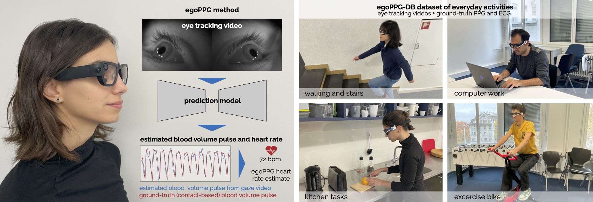

## egoPPG: Heart Rate Estimation from Eye Tracking Cameras in Egocentric Systems to Benefit Downstream Vision Tasks (ICCV 2025)

[Björn Braun](https://bjoernbraun.com/), [Rayan Armani](https://rayanarmani.github.io/), [Manuel Meier](https://github.com/meierman1), [Max Moebus](https://maxmoebus.com), [Christian Holz](https://www.christianholz.net)<br/>

[Sensing, Interaction & Perception Lab](https://siplab.org), Department of Computer Science, ETH Zürich, Switzerland <br/>

___________

## :wave: egoPPG
___________
egoPPG is a novel vision task for egocentric systems to recover a person’s cardiac activity to aid downstream vision tasks.
Our method, *PulseFormer* continuously estimates the person’s photoplethysmogram (PPG) from areas around the eyes and fuses motion cues from the headset’s inertial measurement unit to track HR values. 
We demonstrate egoPPG’s downstream benefit for a key task on EgoExo4D, aexisting egocentric dataset for which we find PulseFormer’s estimates of HR to improve proficiency estimation by 14%.


## :movie_camera: egoPPG-DB dataset
___________
To train and validate *PulseFormer*, we collected a dataset of 13+ hours of eye tracking videos from Project Aria and contact-based PPG signals as well as an electrocardiogram (ECG) for ground-truth HR values. 
Similar to EgoExo4D, 25 participants performed diverse everyday activities such as office work, cooking, dancing, and exercising, which induced significant natural motion and HR variation (44–164 bpm).

To download the *egoPPG-DB* dataset, which we recorded ourselves for training and evaluating egoPPG, please visit the following link: [egoPPG-DB dataset](https://polybox.ethz.ch/index.php/s/JCRjk2TTzaMrfes). You will need to sign a Data Transfer and Use Agreement (DTUA) form to agree to our terms of use. Please note that only members of an institution (e.g., a PI or professor) can sign this DTUA. After you have signed the DTUA, you will receive a download link via email. The dataset is around 220GB in size. The dataset is only for non-commercial, academic research purposes.

## :wrench: Setup
___________
To use the environment we used for our paper, simply run: 
```
conda env create -f environment.yml`
conda activate egoPPG
```

## :file_folder: Code structure
___________
#### egoPPG task
The following three folders contain all code related to the egoPPG task of predicting HR from eye-tracking videos on egoPPG-DB and EgoExo4D datasets:
- configs/: contains all config files to run preprocessing and ML experiments
- preprocessing/: code to preprocess the *egoPPG-DB* and EgoExo4D dataset to get training and inference data for ML models
- ml/: code to run ML experiments for HR estimation from eye-tracking videos from *egoPPG-DB* and EgoExo4D using different models

#### Downstream task: Proficiency estimation on EgoExo4D
IMPORTANT: CODE STILL IN THE PROCESS OF BEING CLEANED UP AND DOCUMENTED. PLEASE BEAR WITH US.

The *proficiency_estimation/* folder contains all code related to the downstream proficiency estimation task on EgoExo4D using the [TimeSformer](https://github.com/facebookresearch/TimeSformer) architecture and the estimated HR values from the egoPPG task:


## Preprocessing for egoPPG task
___________
Run all scripts from the root folder (egoPPG) due to relative imports.

#### Preprocessing egoPPG-DB
1. Adjust the config file in *configs/preprocessing/config_preprocessing_egoppg.yaml* according to your paths and desired preprocessing parameters (downsampling, upsampling, window size, etc.). 
2. Run the preprocessing script using the config file *config_preprocessing_egoppg.yaml*:

```
python -m preprocessing.preprocessing_egoppg --cfg_path configs/preprocessing/config_preprocessing_egoppg.yaml
```

#### Preprocessing EgoExo4D
To predict HR on EgoExo4D (for the egoPPG task), you will need to preprocess the EgoExo4D dataset first so that you can then run the inference of the models trained on egoPPG-DB.

1. To preprocess the EgoExo4D dataset, update the *configs/preprocessing/config_preprocessing_egoexo4d.yaml* file according to your paths and desired preprocessing parameters (downsampling, upsampling, window size, etc.).
2. Run the preprocessing script using the config file *config_preprocessing_egoexo4d.yaml*:

```
python -m preprocessing.preprocessing_egoppg --cfg_path configs/preprocessing/config_preprocessing_egoexo4d.yaml
```

Important:
- The eye tracking videos of the EgoExo4D dataset are originally recorded at only 10 fps, whereas the egoPPG-DB dataset is recorded at 30 fps. 
- We found that upsampling the EgoExo4D eye-tracking videos to 30 fps using linear interpolation between frames during preprocessing improves the HR estimation performance. Therefore, we recommend the following settings when aiming to predict HR on EgoExo4D: 
  - *config_preprocessing_egoexo4d.yaml*: set upsampling factor to 3 (and downsampling factor to 1)
  - *config_preprocessing_egoppg.yaml*: set downsampling factor to 3 and upsampling factor to 3. This first downsamples the egoPPG-DB data from 30 fps to 10 fps and then upsamples it back to 30 fps, matching exactly the preprocessing of the EgoExo4D data. This ensures a smaller domain gap between training and inference data when training on egoPPG-DB and inferring on EgoExo4D.
    - Note: This data will be saved into a folder named Down1_*_Up3. 1 is the effective downsampling factor (downsampling//upsampling).

## Training and inference of models for egoPPG task
___________
Run all scripts from the root folder (egoPPG) due to relative imports.

#### General instructions
To train and evaluate ML models for the egoPPG task, you simply have to run the *ml/main_ml.py* script with different config files located in *configs/ml/*.
The config files specify which model is used and on which dataset the model is trained and evaluated (egoPPG-DB or EgoExo4D).
You also have to specify the paths to the preprocessed data in the config files (important: adjust to the configs chosen during the preprocessing step).
For example, to train and evaluate the PulseFormer model on egoPPG-DB for HR estimation, run:

```
python -m ml.main_ml --cfg_path configs/ml/egoppg_egoppg_PulseFormer.yaml
```

#### Most important config parameters
- TOOLBOX_MODE: specify whether you want to train and test or only test
- INPUT_SIGNALS/LABEL_SIGNALS: specify which input and label signals to use (e.g., eye videos as input and PPG as label). The names have to match the names used during preprocessing.
- DATA_PATH: overall path to the folder where you saved the preprocessed data of all datasets during the preprocessing step
- FILE_PATH: if you want to save small files, such as logs, to a different folder than DATA_PATH. Can be the same as DATA_PATH.
- CACHED_PATH: specify the path to the dataset, on which you want to train and test. train and test can be specified separately if you, e.g., want to train on egoPPG-DB and test on EgoExo4D.
- MODEL_NAME: specify which model to use (PulseFormer, TS-CAN, DeepPhys, etc.)

#### Adding a new model
To add a new model, you need to create three new files and make changes in two other files:
1) Create a new model file in *ml/models/*, e.g., *my_model.py*, which contains the architecture of your model. You can use existing model files as a template.
2) Create a new trainer file in *ml/trainer/*, e.g., *my_model_trainer.py*, which contains the training and evaluation logic for your model. You can use existing trainer files as a template.
3) Create a new config file in *configs/ml/*, e.g., *egoppg_egoppg_my_model.yaml*, which specifies the parameters for training and evaluating your model. Naming is usually in the format: *trainset_testset_model.yaml*.
4) In *ml/trainer/__init__.py*, import your new trainer class.
5) In *ml/main_ml.py*, add a new condition to instantiate your trainer class in BOTH the *train_and_test* and the *test* function.

#### Preprocessing a new dataset
To preprocess a new dataset, you need to create a new preprocessing script and a new config file:
1) Create a new preprocessing script in *preprocessing/*, e.g., *preprocessing_my_dataset.py*, which contains the logic to preprocess your dataset. You can use existing preprocessing scripts as a template.
2) Create a new config file in *configs/preprocessing/*, e.g., *config_preprocessing_my_dataset.yaml*, which specifies the parameters for preprocessing your dataset. Naming is usually in the format: *config_preprocessing_my_dataset.yaml*.

#### Other notes
- The validation set size is set to 10% of the training set. Adjust in *ml_helper.py* if needed.

## Proficiency estimation
___________
create_split_files: script to create the split files for proficiency estimation task

TODO: ADD NUMBER OF TAKES EXCLUDED (EXPECTED)

#### Download EgoExo4D data
Data has to be downloaded from official EgoExo4D repository: https://ego-exo4d-data.org/#intro 
You need the annotations, VRS files (for IMU data), the ET videos and the POV videos (for the downstream proficiency estimation task).
Alternatively, you can also run PulseFormer without the motion-informed temporal attention (MITA) module. Then, you do not need the VRS files (IMU data).
To get the needed data, run the following commands with the Ego4D downloader:
1) egoexo -o PATH_SAVE_FOLDER --parts take_vrs_noimagestream metadata annotations downscaled_takes/448


3) egoexo -o PATH_SAVE_FOLDER --views ego --parts takes
3) egoexo -o PATH_SAVE_FOLDER --views ego --parts downscaled_takes/448

## :scroll: Citation
___________
If you find our [paper](https://arxiv.org/abs/2502.20879), code or dataset useful for your research, please cite our work.

```
@article{braun2025egoppg,
  title={egoppg: Heart rate estimation from eye-tracking cameras in egocentric systems to benefit downstream vision tasks},
  author={Braun, Bj{\"o}rn and Armani, Rayan and Meier, Manuel and Moebus, Max and Holz, Christian},
  journal={arXiv preprint arXiv:2502.20879},
  year={2025}
}
```

## Disclaimer
___________
The structure of the code in this repository is strongly inspired by the [rPPG-Toolbox](https://github.com/ubicomplab/rPPG-Toolbox/tree/main). Make sure to also check it out for other rPPG methods and datasets!

